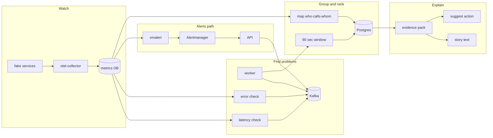

# Causeway — Simple Guide (for you + interviews)

> **What this file is:** A plain-language explanation of the project.  
> **When you change the project:** Add a line in [Build log](#build-log) at the bottom.

---

## Words you will see a lot

| Word | Simple meaning |
|------|----------------|
| **Service / microservice** | One small program in a bigger app (example: `payment-svc` handles payments). |
| **Mesh** | Many services that call each other, like a mini fake company app we run for demos. |
| **Trace** | A record of one user request as it hops through services. |
| **Metrics** | Numbers over time (latency, errors, call counts). |
| **Signal** | One “something is wrong” event (slow service, alert, error spike). |
| **Incident** | A group of related signals treated as one outage story. |
| **Root cause (RCA)** | The service that most likely **started** the problem. |
| **Topology / service graph** | A map of who calls whom (`frontend` → `checkout` → `payment`). |
| **Kafka (Redpanda)** | A message queue; services publish events, worker reads them. |
| **VictoriaMetrics (VM)** | Where we store and query metrics. |
| **Postgres** | Database where incidents, signals, and results are saved. |
| **Evidence pack** | A structured summary the AI (or template) must stick to when explaining. |

---

## What is Causeway? (one paragraph)

When many services break at once, you get **lots of alerts** and it is hard to know **which service broke first** and **which others are just affected**.

**Causeway** watches metrics and alerts, groups related problems into **incidents**, uses the **call map** to guess the **root cause**, then builds a **short explanation** backed by real data (not made-up text).

Everything runs in **Docker** on your laptop for demos and interviews.

---

## The big picture in 5 steps

Think of Causeway like a hospital triage desk:

1. **Watch** — Fake shop app runs; traces become metrics in VictoriaMetrics.  
2. **Spot trouble** — Every ~15 seconds, code checks “is latency or errors unusual?” → creates a **signal**.  
3. **Collect for 90 seconds** — Related signals sit in a bucket (time window).  
4. **Group & rank** — Signals that belong together become one **incident**. The call map helps rank **who is most likely the root cause**.  
5. **Explain safely** — Build an **evidence pack**, then write a narrative (ChatGPT or a template). Suggest a **safe** next step (does not auto-fix production).

---

## What happens when you run `make demo`? (story form)

1. You slow down **payment-svc** on purpose and send traffic through **frontend**.  
2. Traces go to **OpenTelemetry collector** → metrics land in **VictoriaMetrics**.  
3. **Worker** reads metrics: “payment is much slower than its normal baseline” → sends a **signal** to **Kafka**.  
4. Worker also reads Kafka and keeps signals for **90 seconds**.  
5. After 90 seconds it asks: “Which signals belong to the same outage?” (time + who-calls-whom).  
6. It saves an **incident** in **Postgres**, ranks services (hopefully **payment-svc** near the top).  
7. You call the **API**: see incident, evidence, narrative, suggested action.

**You need `make up` first** so the mesh on port **8081** is running. Otherwise `make demo` fails.

---

## Diagram (same story, visual)



---

## How detection works (Phase D — simple)

For each service (example: `payment-svc`):

1. **EWMA baseline** — “What is normal latency lately?”  
2. **Z-score** — “How many ‘standard deviations’ worse is it right now?” If very high → signal.  
3. **Page-Hinkley** — “When did the change **start**?” (stored as `onset_at`, not just “now”).  
4. Same idea for **error rate** in `detectors/errors.py`.

Settings in `docker-compose.yml`: `DETECT_Z=3`, check every `DETECT_INTERVAL_SEC=15`.

---

## How grouping works (Phase C — simple)

When the 90-second window ends:

1. Load **who calls whom** from the database (from recent metrics).  
2. For each pair of signals, compute **distance**:  
   - far apart in **time** → probably different incidents  
   - far apart on the **graph** (many hops) → probably different incidents  
3. **Cluster** similar signals (HDBSCAN — a clustering algorithm).  
4. **One cluster = one incident.** Two unrelated outages → two incidents.

---

## How root-cause ranking works (simple)

**Main method:** PageRank on the call graph — like ranking web pages, but for “where did the pain enter the system?” Services with strong signals and **early** onset get boosted.

**Backup:** If the graph is missing, sort by **severity** only.

Code: `localiser/blame.py` (main), `localiser/rank.py` (backup).

---

## What is a Signal? (one JSON shape for everything)

File: `api/models/signal.py`

| Field | Plain English |
|-------|----------------|
| `signal_id` | Unique name for this event |
| `kind` | Type: alert, slow traces, errors, … |
| `node_id` | Which thing broke, e.g. `svc:payment-svc` |
| `severity` | How bad, 0 to 1 |
| `onset_at` | When the problem **started** |
| `observed_at` | When we **noticed** it |
| `payload` | Extra numbers and labels |

Different kinds go to different Kafka topics (traces vs alerts).

---

## Docker: what each box does

| Container | Plain English |
|-----------|----------------|
| **frontend, payment-svc, …** | Fake app (Go), sends traces |
| **otel-collector** | Converts traces to metrics |
| **victoria-metrics** | Stores metrics |
| **vmalert + alertmanager** | Rules like “latency > X” → webhook to API |
| **redpanda** | Kafka — message bus for signals |
| **postgres** | Stores incidents, signals, evidence |
| **causeway-api** | HTTP API on port **8000** |
| **causeway-worker** | Detects problems, reads Kafka, creates incidents |

**Ports:** `8000` API · `8080` shop front · `8081` payment (for faults) · `8428` metrics UI/query

---

## Where code lives (folder guide)

| Folder | You open this when… |
|--------|---------------------|
| `api/` | HTTP routes: list incidents, narrate, ingest alerts |
| `worker/main.py` | Three loops: Kafka consumer, detectors, topology refresh |
| `detectors/` | Latency + error detection math |
| `correlator/` | 90s window, clustering, save incident |
| `topology/` | Pull call graph from metrics → database |
| `localiser/` | Rank root cause |
| `evidence/` | Build pack for narrative |
| `narrator/` | OpenAI + template + validator |
| `actions/` | Suggest only (e.g. “dump pool stats”) — **does not run fixes** |
| `bench/` | Test RCA quality without live mesh |
| `meshgen/` | Go fake services |
| `loadgen/` | Fault + traffic scripts |
| `Makefile` | Short commands: `demo`, `test`, `bench` |

---

## Database tables (what we store)

| Table | Plain English |
|-------|----------------|
| `signal` | Every event we saw |
| `incident` | One outage episode |
| `incident_signal` | Which signals belong to which incident |
| `cause_candidate` | Ranked list “maybe this service caused it” |
| `edge_observation` | Call graph edges over time |
| `topology_snapshot` | Snapshot of the map for an incident |
| `evidence_pack` | Facts for AI/template |
| `narrative` | Saved explanation text |
| `ground_truth` | Correct answer for benchmarks |

---

## Project phases (what is done vs next)

| Phase | What we built | Status |
|-------|----------------|--------|
| **A** | Nicer API JSON, template story if no OpenAI, 90s window, tests | **Done** |
| **B** | Replay tests, `make bench` checks top-1 root cause | **Done** |
| **C** | Smart grouping (graph + clustering), multiple incidents | **Done** |
| **D** | Smart detectors (baseline + when it started), error detector | **Done** |
| **E** | Alerts from vmalert → API → Kafka (polish + docs) | **Partly done** |
| **F** | Slack, policy on actions, maybe saturation alerts | **Not started** |

---

## What to build next (roadmap)

1. Finish **Phase E** — prove vmalert → Alertmanager → API → worker end to end with steady traffic.  
2. **Phase F** — notify Slack; gate actions with policy.  
3. More **bench scenarios** and run tests in CI.

When you finish something, write it in **Build log** below.

---

## Commands you use often

```bash
make up              # start everything (including fake app)
make test            # unit tests (9 tests)
make bench           # check root-cause accuracy on saved data
make demo            # break payment + load (needs full stack)
make logs            # watch worker (detected … correlator flushed …)
make score           # is top guess = payment-svc?
make narrate         # generate story (OpenAI or template)
make narrative       # read saved story
make action          # suggested diagnostic step only
```

After editing detectors: `docker compose restart causeway-worker`

---

## Interview: how to present (simple script)

**Opening (30 sec):**  
“Many microservices mean many alerts. Causeway groups alerts using time and the call graph, ranks the likely root service, and explains the incident using evidence the AI cannot invent.”

**Demo (3 min):**  
`make up` → `make demo` → wait ~2 min → `make logs` → show API incidents and top candidate.

**If they ask “what’s special?”**  
“We don’t only threshold at 200ms — we learn a baseline, detect when change started, cluster related signals, and rank on the topology graph.”

**If they ask “what’s missing for production?”**  
“Single worker, no API auth, suggest-only actions — it’s a strong **prototype** on Docker.”

**One line to remember:**  
*“Group related signals, rank root cause on the call graph, explain with evidence.”*

---

## Interview Q&A (short answers)

**Why Kafka?**  
So alerts, detectors, and future sources all send the **same message shape**. The worker groups them in one place.

**Why 90 seconds?**  
Enough time for related services to show up in one bucket; still short for demos. Change with `CORR_WINDOW_SEC`.

**Why PageRank?**  
Problems often flow **down** the call chain; ranking on the graph finds where it likely entered.

**How stop AI from lying?**  
Validator checks every claim against IDs in the evidence pack (`EV-SIG-0001`, etc.). No key → template narrator.

---

## Build log

| Date | What changed |
|------|----------------|
| 2026-09-10 | Phases A–D done; detectors fixed; `make test` 9/9. |
| _add here_ | Phase E complete, Slack, etc. |

---

## More detail in the repo

- `README.md` — quick demo commands  
- `db/migrations/0001_init.sql` — full database schema  
- `deploy/vmalert/rules.yaml` — alert rules  

*Last updated: 2026-09-10*
