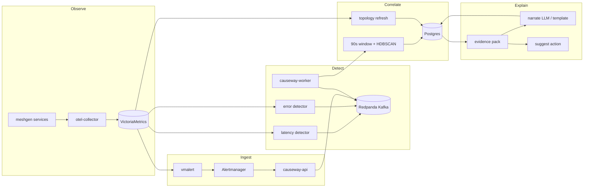

# Causeway — Understanding & Interview Guide

> **Purpose of this doc:** Explain what Causeway is, how it works today, how the repo is organized, what we are building next, and how to present it in an interview.  
> **Update rule:** When you finish a phase or add a major feature, add a dated bullet under [Build log](#build-log) and adjust [Roadmap](#roadmap-whats-next).

---

## 30-second elevator pitch

**Causeway** is a **topology-aware AIOps engine** that turns noisy observability data into **actionable incidents**:

1. **Observe** — OpenTelemetry traces from a microservice mesh become metrics in VictoriaMetrics (service graph + span metrics).
2. **Detect** — Workers poll metrics and emit **signals** (latency/error shifts with real **onset times**) onto Kafka.
3. **Correlate** — Signals in a **90-second window** are clustered (graph distance + HDBSCAN) into one or more **incidents**.
4. **Localize** — A **blame-graph PageRank** ranks likely root-cause services using topology + severity + early onset.
5. **Explain** — An **evidence pack** grounds LLM or template **narratives** and safe **diagnostic actions** (suggest only, no auto-remediation).

It runs **entirely on Docker Compose** for demos, with benchmarks and unit tests to prove correlation and RCA quality.

---

## Interview story arc (5–7 minutes)

Use this order when presenting live or on slides.

| Step | What to say | What to show |
|------|-------------|--------------|
| **1. Problem** | “Alerts and dashboards don’t tell you *which service* caused a blast radius incident or *when* it started.” | One slide: many alerts, one outage |
| **2. Idea** | “We unify signals on a **canonical envelope**, correlate in **time + topology**, then rank causes on the **service graph**.” | Architecture diagram below |
| **3. Demo env** | “Synthetic Go mesh (~12 services), OTel collector, VM, Redpanda, Postgres.” | `docker compose ps` or compose file |
| **4. Happy path** | “Inject latency on `payment-svc`, load traffic, wait for window flush.” | `make demo` → `make logs` |
| **5. Outcome** | “Incident with candidates; top-1 should be `svc:payment-svc` on payment scenario.” | `make score`, `GET .../candidates` |
| **6. Trust** | “Narrative must cite evidence IDs; validator rejects hallucinations; template fallback without API key.” | `make narrate`, evidence pack JSON |
| **7. Engineering** | “Phases A–D done: polish, bench, HDBSCAN correlation, EWMA + Page-Hinkley detectors. Next: Alertmanager ingest polish, Slack/OPA.” | This doc + `make test` / `make bench` |

**Sound bite:** *“Causeway is correlation + graph-based RCA with grounded narratives—not another dashboard.”*

---

## End-to-end flow (today)



### Sequence (detailed)

1. **Traffic & faults**  
   - `loadgen/fault_and_load.sh` (via `make demo`) adds latency on `payment-svc` and sends load through `frontend:8080`.  
   - Each mesh service exports OTLP to the collector.

2. **Metrics**  
   - Collector writes **service graph** and **span metrics** (latency, call counts, status) to VictoriaMetrics (`VM_URL`).

3. **Topology (background)**  
   - Worker `topology_loop` calls `topology.persist.refresh_topology`: reads graph edges from VM → `edge_observation` + `topology_snapshot` in Postgres.  
   - Used for correlation distances and blame-graph edges.

4. **Detection (every ~15s)**  
   - `detect_loop` runs `detect_latency_signals` and `detect_error_signals`.  
   - Per service: **EWMA baseline** → z-score; **Page-Hinkley** on residual for **onset_at**.  
   - Fires when z ≥ `DETECT_Z` (default 3) after `DETECT_MIN_SAMPLES`, or cold-start absolute thresholds.  
   - Publishes JSON `Signal` to Kafka topic `signals.traces` (and could use `signals.alerts` from webhooks).

5. **Consumption**  
   - Same worker **consumes** all signal topics (`signals.alerts`, `signals.k8s`, `signals.deploys`, `signals.logs`, `signals.traces`).  
   - Each message goes into `windowBuffer` (`CORR_WINDOW_SEC=90`).

6. **Incident creation**  
   - When the window expires:  
     - Load recent **edges** from Postgres.  
     - **Pairwise affinity** (`correlator/affinity.py`): time gap + graph hops (hard gate if hops > 4).  
     - **HDBSCAN** (`correlator/cluster.py`) → one or more clusters.  
     - Each cluster → one **incident**: signals linked, **cause candidates** ranked, **evidence pack** stored.

7. **RCA ranking**  
   - Primary: `localiser.blame.rank_by_blame` — personalized PageRank on service graph, boosted by signal severity and **earlier onset**.  
   - Fallback: `localiser.rank.rank_by_severity`.

8. **API & operator loop**  
   - FastAPI serves incidents, candidates, graph, evidence, narrate, actions, feedback.  
   - `POST /ingest/alerts` accepts Alertmanager webhooks → `signals.alerts` (vmalert rules in `deploy/vmalert/rules.yaml`).

---

## Canonical signal model

Every event is a **`Signal`** (`api/models/signal.py`):

| Field | Role |
|-------|------|
| `signal_id` | Unique id |
| `kind` | `alert`, `trace_latency_shift`, `trace_error_shift`, etc. |
| `node_id` | `svc:payment-svc`, `pod:...`, … |
| `severity` | 0–1 |
| `onset_at` | When the anomaly **started** (PH or alert startsAt) |
| `observed_at` | When we detected it |
| `payload` | Metrics, z-scores, alert labels, … |

**Kafka routing:** `signal.kafka_topic()` maps kind → topic (e.g. traces → `signals.traces`).

---

## Infrastructure map (Docker Compose)

| Service | Role |
|---------|------|
| **meshgen** (`frontend`, `payment-svc`, …) | Synthetic microservice mesh, OTLP export |
| **otel-collector** | Receives traces, exports metrics to VM |
| **victoria-metrics** | Time-series store + PromQL queries |
| **vmalert + alertmanager** | Rule-based alerts → webhook → API ingest |
| **redpanda** | Kafka-compatible bus for signals |
| **postgres** (+ pgvector) | Topology, signals, incidents, evidence, narratives |
| **causeway-api** | FastAPI :8000 |
| **causeway-worker** | Detectors + Kafka consumer + topology refresh |

**Ports you care about:** `8000` API, `8080` mesh entry, `8081` payment-svc (fault target), `8428` VM, `9093` Alertmanager.

---

## Codebase map (where to look)

```
AIOps_Causeway/
├── api/                    # FastAPI: health, ingest, incidents API
│   ├── main.py
│   ├── models/signal.py    # Signal envelope + Kafka topic mapping
│   └── routes/
│       ├── ingest.py       # POST /ingest/signal, /ingest/alerts
│       └── incidents.py    # list, candidates, graph, evidence, narrate, actions
├── worker/
│   └── main.py             # consume(), detect_loop(), topology_loop()
├── detectors/
│   ├── baseline.py         # EWMA mean/variance, z-score
│   ├── changepoint.py      # Page-Hinkley onset
│   ├── latency.py          # VM span latency → TRACE_LATENCY_SHIFT
│   ├── errors.py           # VM error ratio → TRACE_ERROR_SHIFT
│   └── test_detectors.py
├── correlator/
│   ├── window.py           # 90s buffer, flush → incidents
│   ├── affinity.py         # pairwise distance matrix
│   ├── graph.py            # adjacency, hop distance
│   ├── cluster.py          # HDBSCAN clustering
│   └── db.py               # Postgres writes
├── topology/
│   ├── servicegraph.py     # PromQL → edges from VM
│   └── persist.py          # edge_observation + snapshots
├── localiser/
│   ├── blame.py            # PageRank blame graph
│   └── rank.py             # severity fallback
├── evidence/
│   └── build.py            # evidence pack for narrate/validate
├── narrator/
│   ├── openai_narrator.py
│   ├── template_narrator.py
│   └── validate.py         # grounded citations EV-*
├── actions/
│   └── suggest.py          # read-only diagnostic suggestions
├── bench/                  # replay fixtures, metrics, correlate tests
├── meshgen/                # Go synthetic services
├── deploy/                 # otel, vmalert rules, alertmanager config
├── loadgen/                # fault + load scripts
├── db/migrations/          # schema
├── Makefile                # demo, test, bench, score, …
└── docker-compose.yml
```

---

## Data model (Postgres highlights)

| Table | Purpose |
|-------|---------|
| `edge_observation` | Time-bucketed service graph edges (calls, shares) |
| `topology_snapshot` | Point-in-time graph JSON for incidents |
| `signal` | All ingested signals |
| `incident` | Correlation window + status |
| `incident_signal` | M:N link |
| `cause_candidate` | Ranked RCA results + feature JSON |
| `evidence_pack` | Structured facts for LLM + validator |
| `narrative` | Stored narrate output |
| `ground_truth` / `feedback` | Bench and human feedback |

---

## Build phases (spec vs status)

| Phase | Focus | Status |
|-------|--------|--------|
| **A** | Polish: JSON API, template narrate, 90s window, validator tests | Done |
| **B** | Bench: fixtures, replay, top-1/top-3 metrics (`make bench`) | Done |
| **C** | Correlation: graph affinity, HDBSCAN, multi-incident flush | Done |
| **D** | Detectors: EWMA + Page-Hinkley, error detector, worker wiring | Done |
| **E** | Alertmanager → Kafka alerts; vmalert rules tuned with detectors | Partial (ingest exists; tighten rules + ops) |
| **F** | Slack notifications, OPA-gated actions, saturation detector | Planned |
| **G+** | Embeddings on signals, conformal prediction, merge/split incidents | Future |

---

## Roadmap (what’s next)

Use this section in interviews as “honest next steps.”

1. **Phase E (complete)**  
   - Ensure vmalert fires reliably with ongoing traffic (`increase` vs `rate`, `for:` duration).  
   - Document runbook: mesh up → traffic → Alertmanager → worker logs on `signals.alerts`.

2. **Phase F**  
   - Slack webhook on new incident.  
   - OPA policy: which suggested actions operators may run.  
   - Optional `SATURATION` detector (pool/queue metrics).

3. **Quality**  
   - More bench scenarios (error spikes, dual region).  
   - Track top-1 / top-3 over time in CI.

4. **Production-minded** (talking points only for local demo)  
   - Horizontal worker consumers with partition keys on `node_id`.  
   - Idempotent signal ingest, retention policies on Kafka.  
   - Secrets via env, not images.

---

## Build log

Append dated entries as you ship work.

| Date | Change |
|------|--------|
| 2026-09-10 | Phases A–D: correlation, bench, EWMA/PH detectors; `make test` 9/9 in Docker. |
| _TBD_ | Phase E: end-to-end vmalert demo documented. |
| _TBD_ | Phase F: Slack + OPA. |

---

## Operator cheatsheet

```bash
make up              # full stack including mesh
make verify-dns      # container DNS + API health
make test            # narrator + detector unit tests
make bench           # RCA replay, assert top-1
make bench-correlate # multi-cluster fixture
make demo            # fault payment-svc + load (needs :8081)
make logs            # worker: detected … z= … correlator flushed …
make score           # bench top-1 vs ground truth
make evidence
make narrate         # OpenAI or template fallback
make narrative       # GET stored narrative (after narrate)
make action          # suggest diagnostic action (not applied)
```

After changing detectors: `docker compose restart causeway-worker`.

---

## How to explain Causeway to another engineer

### If they know **Kubernetes / SRE**

> “We ingest alerts and trace-derived signals on Kafka, correlate them in a sliding window using **service graph distance**, cluster with **HDBSCAN**, then run **PageRank on the blame graph** to rank root cause. Evidence is structured so an LLM can’t invent services—we validate every citation.”

### If they know **data / ML**

> “Signals are multivariate time series per node. We use **EWMA z-scores** and **Page-Hinkley** for detection and onset. Correlation is **unsupervised clustering** on a custom distance: temporal + topological. RCA is graph ranking with personalization from severity and onset—not a black-box model.”

### If they know **streaming**

> “**Redpanda** topics by signal type; one worker consumes and buffers; flush triggers **stateful** Postgres writes. Detection is a separate loop publishing to the same bus. Topology is refreshed periodically from VM metrics.”

### Common interview questions

**Q: Why Kafka if the worker also polls VM?**  
A: Decouples **producers** (detectors, webhooks, future k8s watches) from **correlation**. Same envelope whether the source is pull or push.

**Q: Why 90 seconds?**  
A: Trade-off: enough time to collect related signals across the blast radius, short enough for interactive demos. Configurable via `CORR_WINDOW_SEC`.

**Q: Why PageRank for RCA?**  
A: Failures propagate **upstream** in call graphs; random-walk style scores reflect “where anomalous mass entered the graph,” personalized by which nodes actually fired signals and when.

**Q: How do you prevent LLM hallucinations?**  
A: `narrator/validate.py` requires claims to reference keys like `EV-SIG-0001` present in the evidence pack; template narrator works offline.

**Q: What’s not production-ready?**  
A: Single worker, local Compose, no auth on API, actions are suggest-only. Architecture is meant to show **design**, not hardened multi-tenant ops.

---

## Presentation tips (slides / whiteboard)

1. Draw **three boxes**: Observe → Decide (correlate + rank) → Explain (evidence + narrative).  
2. Show **one JSON Signal** and **one evidence pack entry**—concrete beats abstract.  
3. Live demo: **`make demo`** → wait 2 min → **`curl localhost:8000/api/v1/incidents`** → top candidate.  
4. Mention **metrics**: `make bench` top-1 = 1.0 on `payment_latency` fixture.  
5. Close with **roadmap** (Phase E/F)—shows you know gaps.

---

## Key environment variables

| Variable | Default | Used by |
|----------|---------|---------|
| `CORR_WINDOW_SEC` | 90 | correlator window |
| `DETECT_INTERVAL_SEC` | 15 | detector poll interval |
| `DETECT_Z` | 3.0 | latency z threshold |
| `DETECT_MIN_SAMPLES` | 3 | EWMA warm-up |
| `DETECT_LATENCY_MS` | 200 | cold-start latency floor |
| `VM_URL` | victoria-metrics:8428 | detectors, topology |
| `KAFKA_BOOTSTRAP` | redpanda:9092 | API ingest, worker |
| `OPENAI_API_KEY` | (optional) | LLM narrate |

---

## References in repo

- Quick demo: `README.md`  
- Schema: `db/migrations/0001_init.sql`  
- Alert rules: `deploy/vmalert/rules.yaml`  
- OTel pipeline: `deploy/otel/gateway.yaml`

---

*Last updated: 2026-09-10 — update [Build log](#build-log) when you ship the next phase.*
