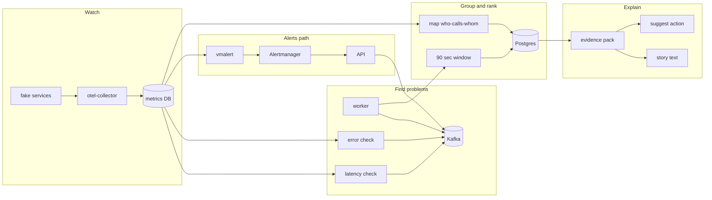

# Causeway — Simple Guide (for you + interviews)

> **What this file is:** A plain-language explanation of the project, plus **developer** and **DevOps** depth for interviews (“I designed and built this end-to-end”).  
> **When you change the project:** Add a line in [Build log](#build-log) at the bottom.

**Quick jump:** [Main components](#main-components-of-the-codebase-must-know) · [Your narrative](#i-built-this-end-to-end--your-narrative) · [Developer guide](#developer-guide--how-to-read-and-change-the-code) · [DevOps guide](#devops-guide--run-verify-debug) · [System design Q&A](#system-design--questions-interviewers-ask) · [Skills map](#learning-map--skills-this-project-demonstrates)

---

## Words you will see a lot

| Word | Simple meaning |
|------|----------------|
| **Service / microservice** | One small program in a bigger app (example: `payment-svc` handles payments). |
| **Mesh** | Many services that call each other, like a mini fake company app we run for demos. |
| **Trace** | A record of one user request as it hops through services. |
| **Metrics** | Numbers over time (latency, errors, call counts). |
| **Signal** | One “something is wrong” event (slow service, alert, error spike). |
| **Incident** | A group of related signals treated as one outage story. |
| **Root cause (RCA)** | The service that most likely **started** the problem. |
| **Topology / service graph** | A map of who calls whom (`frontend` → `checkout` → `payment`). |
| **Kafka (Redpanda)** | A message queue; services publish events, worker reads them. |
| **VictoriaMetrics (VM)** | Where we store and query metrics. |
| **Postgres** | Database where incidents, signals, and results are saved. |
| **Evidence pack** | A structured summary the AI (or template) must stick to when explaining. |

---

## What is Causeway? (one paragraph)

When many services break at once, you get **lots of alerts** and it is hard to know **which service broke first** and **which others are just affected**.

**Causeway** watches metrics and alerts, groups related problems into **incidents**, uses the **call map** to guess the **root cause**, then builds a **short explanation** backed by real data (not made-up text).

Everything runs in **Docker** on your laptop for demos and interviews.

---

## The big picture in 5 steps

Think of Causeway like a hospital triage desk:

1. **Watch** — Fake shop app runs; traces become metrics in VictoriaMetrics.  
2. **Spot trouble** — Every ~15 seconds, code checks “is latency or errors unusual?” → creates a **signal**.  
3. **Collect for 90 seconds** — Related signals sit in a bucket (time window).  
4. **Group & rank** — Signals that belong together become one **incident**. The call map helps rank **who is most likely the root cause**.  
5. **Explain safely** — Build an **evidence pack**, then write a narrative (ChatGPT or a template). Suggest a **safe** next step (does not auto-fix production).

---

## What happens when you run `make demo`? (story form)

1. You slow down **payment-svc** on purpose and send traffic through **frontend**.  
2. Traces go to **OpenTelemetry collector** → metrics land in **VictoriaMetrics**.  
3. **Worker** reads metrics: “payment is much slower than its normal baseline” → sends a **signal** to **Kafka**.  
4. Worker also reads Kafka and keeps signals for **90 seconds**.  
5. After 90 seconds it asks: “Which signals belong to the same outage?” (time + who-calls-whom).  
6. It saves an **incident** in **Postgres**, ranks services (hopefully **payment-svc** near the top).  
7. You call the **API**: see incident, evidence, narrative, suggested action.

**You need `make up` first** so the mesh on port **8081** is running. Otherwise `make demo` fails.

---

## Diagram (same story, visual)



---

## How detection works (Phase D — simple)

For each service (example: `payment-svc`):

1. **EWMA baseline** — “What is normal latency lately?”  
2. **Z-score** — “How many ‘standard deviations’ worse is it right now?” If very high → signal.  
3. **Page-Hinkley** — “When did the change **start**?” (stored as `onset_at`, not just “now”).  
4. Same idea for **error rate** in `detectors/errors.py`.

Settings in `docker-compose.yml`: `DETECT_Z=3`, check every `DETECT_INTERVAL_SEC=15`.

**Saturation (Phase G/H2):** `detectors/saturation.py` also queries **`meshgen_fault_active`** in VictoriaMetrics (from vmagent). When you inject a fault on a service, severity ~0.85 and **`fault_active: 1`** in the signal payload. Worker logs show `fault=1`.

---

## How grouping works (Phase C — simple)

When the 90-second window ends:

1. Load **who calls whom** from the database (from recent metrics).  
2. For each pair of signals, compute **distance**:  
   - far apart in **time** → probably different incidents  
   - far apart on the **graph** (many hops) → probably different incidents  
3. **Cluster** similar signals (HDBSCAN — a clustering algorithm).  
4. **One cluster = one incident.** Two unrelated outages → two incidents.

---

## How root-cause ranking works (simple)

**Main method:** PageRank on the call graph — like ranking web pages, but for “where did the pain enter the system?” Services with strong signals and **early** onset get boosted.

**Backup:** If the graph is missing, sort by **severity** only.

Code: `localiser/blame.py` (main), `localiser/rank.py` (backup).

---

## What is a Signal? (one JSON shape for everything)

File: `api/models/signal.py`

| Field | Plain English |
|-------|----------------|
| `signal_id` | Unique name for this event |
| `kind` | Type: alert, slow traces, errors, … |
| `node_id` | Which thing broke, e.g. `svc:payment-svc` |
| `severity` | How bad, 0 to 1 |
| `onset_at` | When the problem **started** |
| `observed_at` | When we **noticed** it |
| `payload` | Extra numbers and labels |

Different kinds go to different Kafka topics (traces vs alerts).

---

## Docker: what each box does

| Container | Plain English |
|-----------|----------------|
| **frontend, payment-svc, …** | Fake app (Go), sends traces |
| **otel-collector** | Converts traces to metrics |
| **vmagent** | Scrapes mesh `/metrics` (requests, fault flag) into VM |
| **victoria-metrics** | Stores metrics |
| **vmalert + alertmanager** | Rules like “latency > X” → webhook to API |
| **redpanda** | Kafka — message bus for signals |
| **postgres** | Stores incidents, signals, evidence |
| **causeway-api** | HTTP API on port **8000** + operator UI at **`/ui`** |
| **causeway-worker** | Detects problems, reads Kafka, creates incidents · **health :8085/healthz** |

**Ports:** `8000` API · `8080` shop front · `8081` payment (for faults) · `8085` worker health · `8428` metrics UI/query

---

## Where code lives (folder guide)

| Folder | You open this when… |
|--------|---------------------|
| `api/` | HTTP routes + serves **`ui/index.html`** |
| `worker/main.py` | Three loops: Kafka consumer, detectors, topology refresh |
| `detectors/` | Latency + error + **saturation** detection |
| `correlator/` | 90s window, clustering, save incident |
| `topology/` | Pull call graph from metrics → database |
| `localiser/` | Rank root cause |
| `evidence/` | Build pack for narrative |
| `narrator/` | OpenAI + template + validator |
| `actions/` | Suggest only (e.g. “dump pool stats”) — **does not run fixes** |
| `bench/` | Test RCA quality without live mesh |
| `meshgen/` | Go fake services |
| `loadgen/` | Fault + traffic scripts |
| `Makefile` | Short commands: `demo`, `test`, `bench` |

---

## Main components of the codebase (must know)

This is the **map of everything you built**. Memorize the **three Causeway layers** first; use the tables below when someone asks “what’s in the repo?” or “how does X talk to Y?”.

### Three layers → folders

| Layer | What it does | Main folders / services |
|-------|----------------|-------------------------|
| **1. Observe & ingest** | Generate or collect telemetry; turn alerts into **Signals** | `meshgen/`, `deploy/otel/`, `deploy/vmagent/`, `deploy/vmalert/`, `detectors/`, `api/routes/ingest.py` |
| **2. Decide** | Correlate signals → **incidents**; rank **root cause** | `worker/`, `correlator/`, `topology/`, `localiser/` |
| **3. Explain & operate** | Evidence, narrative, actions, UI, quality loop | `evidence/`, `narrator/`, `actions/`, `ui/`, `api/routes/incidents.py`, `api/routes/metrics.py`, `bench/` |

### Runtime: what actually runs

| Component | Language | Entry point | Job |
|-----------|----------|-------------|-----|
| **causeway-api** | Python | `api/main.py` (uvicorn) | REST API, Alertmanager webhook, static **UI**, read/write Postgres for operators |
| **causeway-worker** | Python | `worker/main.py` | **Detect** (poll VM) → Kafka; **consume** Kafka → correlate; **topology** refresh |
| **meshgen** (×12) | Go | `meshgen/main.go` | Fake shop microservices, OTLP traces, `/admin/fault` |
| **otel-collector** | — | `deploy/otel/gateway.yaml` | Traces → span metrics + service graph → VM |
| **vmagent** | — | `deploy/vmagent/scrape.yml` | Prometheus scrape mesh `/metrics` → VM |
| **vmalert + alertmanager** | — | `deploy/vmalert/`, `deploy/alertmanager/` | Alert rules → webhook → API |
| **redpanda** | — | `docker-compose.yml` | Kafka bus (`signals.*` topics) |
| **postgres** | — | `db/migrations/0001_init.sql` | System of record |
| **victoria-metrics** | — | Compose | Metrics + PromQL for detectors and topology |

Only **api** and **worker** are your large Python apps; the rest is infra + Go mesh.

### Python modules (your engine) — file-by-file importance

| Module | Key files | Responsibility |
|--------|-----------|----------------|
| **`api.models`** | `signal.py` | **Contract** for all events (`Signal`, `SignalKind`, Kafka topic mapping) |
| **`detectors`** | `baseline.py`, `changepoint.py`, `latency.py`, `errors.py`, `saturation.py` | Pull metrics from VM; EWMA + Page-Hinkley; emit `Signal` list |
| **`worker`** | `main.py` | Orchestrates detect / consume / topology loops |
| **`correlator`** | `window.py`, `dedupe.py`, `affinity.py`, `graph.py`, `cluster.py`, `db.py`, `notify.py` | 90s buffer, dedupe, distance matrix, HDBSCAN, persist incident, optional Slack |
| **`topology`** | `servicegraph.py`, `persist.py` | PromQL edges from VM → `edge_observation` + snapshots |
| **`localiser`** | `blame.py`, `rank.py` | PageRank RCA (+ env `BLAME_*` weights); severity fallback |
| **`evidence`** | `build.py` | JSON pack with `EV-SIG-*`, `EV-RCA-*`, `EV-TOPO-*` keys |
| **`narrator`** | `openai_narrator.py`, `template_narrator.py`, `validate.py` | LLM or template story; block hallucinations |
| **`actions`** | `suggest.py`, `policy.py` | Diagnostic suggestion + allowlist / optional OPA |
| **`bench`** | `replay.py`, `metrics.py`, `feedback_report.py`, `fixtures/` | Offline RCA tests + feedback quality report |

### Kafka topics (signal bus)

| Topic | Typical producer | Consumer |
|-------|------------------|----------|
| `signals.traces` | Worker detectors (latency, error, saturation) | Worker correlator |
| `signals.alerts` | API `/ingest/alerts` (Alertmanager) | Worker correlator |
| `signals.k8s`, `signals.deploys`, `signals.logs` | (future / manual ingest) | Worker correlator (subscribed) |

All messages share the same **`Signal` JSON** shape.

### API surface (what operators and demos call)

| Method | Path | Purpose |
|--------|------|---------|
| GET | `/healthz` | Liveness (+ deps; optional worker via `WORKER_HEALTH_URL`) |
| POST | `/ingest/signal`, `/ingest/alerts` | Push signals to Kafka (**`INGEST_API_KEY`** if set) |
| GET | `/api/v1/*` | Incidents, metrics (**`API_READ_KEY`** if set) |
| POST | `/api/v1/incidents/...` | narrate, feedback, actions (**`INGEST_API_KEY`** if set) |
| GET | `/api/v1/incidents` | List incidents (+ `top_cause`) |
| GET | `/api/v1/incidents/{id}/candidates` | Ranked RCA list |
| GET | `/api/v1/incidents/{id}/timeline` | Signals ordered by onset |
| GET | `/api/v1/incidents/{id}/evidence`, `/graph`, `/narrative` | Explain path |
| POST | `/api/v1/incidents/{id}/narrate`, `/feedback`, `/actions` | Generate story, learning loop, policy check |
| GET | `/api/v1/metrics/rca` | Feedback accuracy (Phase J) |
| GET | `/`, `/ui` | Operator dashboard |

### Deploy & ops (not application logic, but you own them)

| Path | Role |
|------|------|
| `docker-compose.yml` | Full stack wiring, env vars, volumes for hot reload |
| `Dockerfile` | API/worker image (`pip install -e ".[dev]"`) |
| `Makefile` | `demo`, `test`, `bench`, `verify-*`, `feedback-report` |
| `scripts/` | DNS verify, alert verify, live E2E, Kafka wait helper |
| `.github/workflows/ci.yml` | Unit tests on push |
| `loadgen/` | Fault injection + traffic for demos and vmalert |

### Supporting assets (know they exist)

| Path | Role |
|------|------|
| `pyproject.toml` | Package name `causeway`, dependencies, pytest/ruff |
| `.env` / `.env.example` | Secrets (OpenAI, Slack, optional OPA) |
| `understanding.md` | This doc — architecture + interview prep |
| `README.md` | Quick start commands |

### One-line dependency graph (who calls whom)

```text
meshgen → otel-collector → VictoriaMetrics ← vmagent (mesh /metrics)
                              ↑
                         detectors (worker)
                              ↓
                           Kafka ← ingest (API) ← Alertmanager ← vmalert
                              ↓
                         worker consume → correlator → localiser → evidence
                              ↓
                           Postgres ← API ← UI / curl / bench
```

---

## Database tables (what we store)

| Table | Plain English |
|-------|----------------|
| `signal` | Every event we saw |
| `incident` | One outage episode |
| `incident_signal` | Which signals belong to which incident |
| `cause_candidate` | Ranked list “maybe this service caused it” |
| `edge_observation` | Call graph edges over time |
| `topology_snapshot` | Snapshot of the map for an incident |
| `evidence_pack` | Facts for AI/template |
| `narrative` | Saved explanation text |
| `ground_truth` | Correct answer for benchmarks |
| `feedback` | Operator-submitted actual root (Phase J learning loop) |

---

## Project phases (what is done vs next)

| Phase | What we built | Status |
|-------|----------------|--------|
| **A** | Nicer API JSON, template story if no OpenAI, 90s window, tests | **Done** |
| **B** | Replay tests, `make bench` checks top-1 root cause | **Done** |
| **C** | Smart grouping (graph + clustering), multiple incidents | **Done** |
| **D** | Smart detectors (baseline + when it started), error detector | **Done** |
| **E** | Alerts from vmalert → API → Kafka; verify script; dedupe alert+detector | **Done** |
| **F** | Slack on incident; action policy (OPA-ready); traffic helper | **Done (Slack needs webhook URL)** |
| **G** | Saturation detector; error bench fixture; verify-live; GitHub CI | **Done** |
| **H1** | vmagent scrapes mesh `/metrics` → VictoriaMetrics | **Done** |
| **H2** | Saturation fires on `meshgen_fault_active` (injected fault) | **Done** |
| **H3** | `make verify-alerts-live` — vmalert → AM → API → Kafka | **Done** |
| **I** | Operator UI at `/ui` + `GET .../timeline` | **Done** |
| **J** | Feedback report, `/metrics/rca`, tunable blame weights, UI feedback | **Done** |
| **J+** | Live demo script, UI copy ID + narrative panel, alert+latency bench fixture | **Done** |
| **K** | Ingest/read API keys, worker `/healthz`, bench in CI, K8s sketch doc | **Done** |

---

## What to build next (roadmap)

| Phase | Goal | Ideas |
|-------|------|--------|
| **L** | Optional depth | Deploy signals, Grafana dashboard, pgvector, incident merge/split |

**Run now:** `make verify-live` (full stack, ~3 min) · set `INGEST_API_KEY` / `API_READ_KEY` in `.env` for hardened demo · worker health: `curl localhost:8085/healthz`

When you finish something, write it in **Build log** below.

---

## Commands you use often

```bash
make up              # start everything (including fake app)
make ui              # http://localhost:8000/ui
make demo-script     # print 5-min interview demo steps (Phase J+)
make demo-run        # demo-script --run (needs make up)
make test            # unit tests (13+ tests)
make bench           # check root-cause accuracy on saved data
make demo            # break payment + load (needs full stack)
make logs            # watch worker (detected … correlator flushed …)
make score           # is top guess = payment-svc?
make narrate         # generate story (OpenAI or template)
make narrative       # read saved story
make action          # suggested diagnostic step + policy check
make feedback        # POST sample actual root for latest incident
make feedback-report # top-1 / top-3 stats from feedback table
curl localhost:8000/api/v1/metrics/rca   # same stats as JSON
make verify-alerts  # test Alertmanager webhook → API
make verify-alerts-live  # live vmalert path (~2-3 min, needs make up)
make verify-all     # test + bench + verify-alerts
make traffic        # keep mesh busy for vmalert (120s default)
make verify-mesh-metrics  # vmagent → VM (needs make up + ~30s scrape)
make verify-live    # full E2E: fault + correlator + score (slow)
```

After editing detectors: `docker compose restart causeway-worker`

---

## Interview: how to present (simple script)

**Opening (30 sec):**  
“Many microservices mean many alerts. Causeway groups alerts using time and the call graph, ranks the likely root service, and explains the incident using evidence the AI cannot invent.”

**Demo (3 min):**  
`make up` → `make demo` → wait ~2 min → `make logs` → show API incidents and top candidate.

**If they ask “what’s special?”**  
“We don’t only threshold at 200ms — we learn a baseline, detect when change started, cluster related signals, and rank on the topology graph.”

**If they ask “what’s missing for production?”**  
“Single worker HA, full OAuth, and multi-tenant UI auth—but Phase **K** added optional ingest/read keys, worker health, and bench in CI; I’d deploy on K8s with the sketch in our docs.”

**One line to remember:**  
*“Group related signals, rank root cause on the call graph, explain with evidence.”*

---

## Interview Q&A (short answers)

**Why Kafka?**  
So alerts, detectors, and future sources all send the **same message shape**. The worker groups them in one place.

**Why 90 seconds?**  
Enough time for related services to show up in one bucket; still short for demos. Change with `CORR_WINDOW_SEC`.

**Why PageRank?**  
Problems often flow **down** the call chain; ranking on the graph finds where it likely entered.

**How stop AI from lying?**  
Validator checks every claim against IDs in the evidence pack (`EV-SIG-0001`, etc.). No key → template narrator.

---

## “I built this end-to-end” — your narrative

Use this when you present Causeway as **your product + your implementation** (idea → code → ops).

**Problem you chose to solve:**  
Microservices create **alert storms** and **unclear root cause**. Dashboards show symptoms; they do not **group** related events, **rank** blame on the **service graph**, or **explain** with **auditable evidence**.

**Your solution (Causeway):**  
A small platform with three layers:

1. **Ingest** — One `Signal` model; metrics detectors, vmalert webhooks, (future) k8s/deploy events → **Kafka**.  
2. **Decide** — Time window + topology distance + clustering → **incidents**; PageRank → **candidates**.  
3. **Explain** — Evidence pack → validated narrative + **policy-gated** action suggestions.

**What you personally implemented (talk track):**  
Go **meshgen** (synthetic load + fault injection + OTLP), **Python engine** (detectors, correlator, RCA, API, worker), **deploy** (Compose, OTel, VM, vmalert, vmagent, Redpanda, Postgres), **bench/verify** scripts, **operator UI**, and **CI**. You iterated in **phases A–I** with tests and make targets—not a single big bang.

**Differentiator vs “another Grafana dashboard”:**  
Topology-aware correlation, **onset time** (not just “now”), grounded LLM output, and a **full demo loop** you can run locally.

---

## Tech stack — what each piece does (DevOps + developer)

| Technology | Role in Causeway | Why it’s here (what to say in interview) |
|------------|------------------|------------------------------------------|
| **Go (meshgen)** | Fake microservice mesh, `/admin/fault`, OTLP traces | Realistic traces without deploying 12 real apps |
| **OpenTelemetry Collector** | Traces → span metrics + service graph → VM | Industry-standard observability pipeline |
| **VictoriaMetrics** | Metrics store + PromQL | Lightweight Prometheus-compatible TSDB for demos |
| **vmagent** | Scrapes mesh `/metrics` (`meshgen_*`) | App-native metrics alongside trace-derived metrics |
| **vmalert + Alertmanager** | Rule-based alerts → webhook | Shows **push** alerts and **pull** detectors on same bus |
| **Redpanda (Kafka)** | `signals.*` topics | Decouples producers (API, worker) from correlator consumer |
| **Postgres + pgvector** | Incidents, topology, evidence (vectors reserved) | Durable state + future embedding search |
| **FastAPI** | REST + ingest + static UI | Async-friendly API, quick to extend |
| **Python worker** | `asyncio`: consume, detect, topology | One process, three loops—easy to demo; scale later |
| **Docker Compose** | Full stack on one machine | Reproducible demo for interviews and CI |
| **GitHub Actions** | Unit tests on push | Safety net for refactors |
| **Make** | `demo`, `bench`, `verify-*` | Operator-friendly entry points |

---

## Developer guide — how to read and change the code

### Runtime processes (only two you wrote in Python)

| Process | Entry | Responsibility |
|---------|--------|----------------|
| **API** | `api/main.py` → uvicorn | HTTP, ingest to Kafka, read Postgres for UI/clients |
| **Worker** | `worker/main.py` | Detect (poll VM) → publish Kafka; consume Kafka → correlate → Postgres; refresh topology |

Both share libraries under `detectors/`, `correlator/`, `localiser/`, etc. (installed as package `causeway` via `pyproject.toml`).

### Worker concurrency model (important)

```text
asyncio.gather(
  consume(),       # Kafka → windowBuffer.add → flush → incident
  detect_loop(),   # VM queries → Signal → Kafka publish
  topology_loop(), # VM servicegraph → edge_observation
)
```

- **Detect** and **consume** are separate on purpose: same signal shape whether source is **pull** (detector) or **push** (webhook).  
- **Volume mounts** on `correlator/`, `detector/`, `worker/` in Compose → edit code without rebuild during dev.

### Data flow (developer mental model)

```text
VM PromQL → detectors/*.py → Signal (Pydantic) → JSON → Kafka topic
Alertmanager POST → api/routes/ingest.py → same Signal → Kafka
Kafka → worker consume → correlator/window.py (dedupe in buffer)
     → flush → affinity + HDBSCAN → localiser/blame → evidence/build → Postgres
API ← Postgres ← UI / curl / bench
```

### Files you touch most often

| Goal | Start here |
|------|------------|
| New detector | Copy `detectors/latency.py`, add to `DETECTORS` in `worker/main.py` |
| Change correlation window | `CORR_WINDOW_SEC`, `correlator/window.py` |
| Change RCA | `localiser/blame.py` (PageRank weights, onset boost) |
| New API field | `api/routes/incidents.py` + schema in `db/migrations/` if needed |
| Alert rules | `deploy/vmalert/rules.yaml` |
| Scrape targets | `deploy/vmagent/scrape.yml` |
| Demo / fault | `loadgen/fault_and_load.sh`, `meshgen/fault/` |

### How to add a new detector (checklist)

1. Implement `async def detect_X_signals() -> list[Signal]` using `api.models.signal`.  
2. Set **`fingerprint`** for dedupe (see `correlator/dedupe.py`).  
3. Register in `worker/main.py` → `DETECTORS`.  
4. Add unit test under `detectors/`.  
5. `docker compose restart causeway-worker` (or rely on volume mount + restart).  
6. Optional: bench fixture in `bench/fixtures/`.

### Python patterns used in this repo

- **Pydantic v2** — `Signal` is the contract for Kafka and DB JSON.  
- **asyncpg** — direct SQL in routes/worker (no ORM); fast for a focused schema.  
- **aiokafka** — async producer/consumer in worker and ingest.  
- **NumPy + scikit-learn** — distance matrix + HDBSCAN in correlator.  
- **httpx** — async PromQL queries from detectors.

---

## DevOps guide — run, verify, debug

### First-time / daily workflow

```bash
make up              # all containers
make verify-dns      # API + container DNS (WSL)
make verify-mesh-metrics   # wait ~30s after up
make demo            # inject fault + load
make logs            # worker: detected … correlator flushed …
make ui              # browser: incidents + timeline
make score           # top-1 vs payment-svc
```

### Verification ladder (what each proves)

| Command | Proves |
|---------|--------|
| `make test` | Unit logic (EWMA, dedupe, narrator validator, policy) |
| `make bench` | RCA ranker on frozen fixtures (no Docker mesh) |
| `make verify-alerts` | API ingest path (sample webhook) |
| `make verify-mesh-metrics` | vmagent → VM |
| `make verify-alerts-live` | vmalert → AM → API → Kafka (slow) |
| `make verify-live` | Full mesh → incident → top-1 score (slow) |
| `make verify-all` | test + bench + alerts + mesh metrics (stack up) |

### Environment variables (ops cheat sheet)

| Variable | Service | Meaning |
|----------|---------|---------|
| `BLAME_SEV_WEIGHT` / `BLAME_ONSET_WEIGHT` / `BLAME_ONSET_SEC` | worker | PageRank personalization tuning (Phase J) |
| `CORR_WINDOW_SEC` | worker | Incident batching window (default 90) |
| `DETECT_INTERVAL_SEC` | worker | How often detectors poll VM |
| `DETECT_Z` / `DETECT_ERROR_Z` / `DETECT_SAT_Z` | worker | Z-score thresholds |
| `VM_URL` | api, worker | VictoriaMetrics base URL |
| `KAFKA_BOOTSTRAP` | api, worker | Redpanda address |
| `DATABASE_URL_SYNC` | api, worker | Postgres DSN |
| `SLACK_WEBHOOK_URL` | worker | Optional incident notification |
| `OPENAI_API_KEY` | api | LLM narrate (template fallback if unset) |
| `OPA_URL` | api | Optional external policy for actions |
| `INGEST_API_KEY` | api | Bearer / `X-API-Key` on `/ingest/*` and write `POST /api/v1/*` (Phase K) |
| `API_READ_KEY` | api | Bearer / `X-API-Key` on `GET /api/v1/*` (Phase K; UI needs proxy or custom headers) |
| `WORKER_HEALTH_URL` | api | Optional; e.g. `http://causeway-worker:8085/healthz` in Compose |
| `WORKER_HEALTH_PORT` | worker | HTTP liveness (default **8085**) |
| `WORKER_HEARTBEAT_SEC` | worker | Touch heartbeat file interval (default 30) |
| `DOCKER_BUILDKIT=0` | Makefile | WSL/DNS workaround for image builds |

### Debugging playbook

| Symptom | Check |
|---------|--------|
| `make demo` fails on :8081 | `make up`; mesh not running |
| No incidents | `make logs`; wait full **90s** after signals; topology empty? `topology_loop` logs |
| Wrong top-1 | `make graph`; `make bench`; onset order in fixture vs live |
| vmalert never fires | Steady traffic (`make traffic`); latency rule needs `increase` over 1m |
| Kafka empty | `docker compose logs causeway-api` on ingest; Redpanda healthy |
| DNS / build failures | `scripts/setup-wsl-dns.sh`, `DOCKER_BUILDKIT=0` |
| UI empty | Postgres has rows? `curl localhost:8000/api/v1/incidents` |

### CI/CD (what runs today)

- **GitHub Actions** (`.github/workflows/ci.yml`): pytest on push/PR; **`make bench`** RCA regression job (no Docker required).  
- **Not in CI yet:** `verify-live` / full Compose E2E (slow; run locally with `make verify-live`).

### Infrastructure as code in this repo

| Path | Purpose |
|------|---------|
| `docker-compose.yml` | Full stack definition, healthchecks, volumes |
| `Dockerfile` | API + worker image (`pip install -e ".[dev]"`) |
| `deploy/otel/gateway.yaml` | Collector pipelines (spanmetrics, servicegraph) |
| `deploy/vmalert/rules.yaml` | Alert rules |
| `deploy/alertmanager/alertmanager.yml` | Webhook to Causeway API |
| `deploy/vmagent/scrape.yml` | Mesh Prometheus scrape |
| `deploy/opa/policy.rego` | Sample action policy |
| `db/migrations/0001_init.sql` | Schema bootstrap on Postgres init |

---

## System design — questions interviewers ask

**Q: Why not one monolith that polls everything?**  
A: Kafka lets **multiple producers** (detectors, webhooks, future agents) share one **correlation consumer**. Same `Signal` schema everywhere.

**Q: Why Postgres and not only Kafka?**  
A: Incidents, evidence, and UI need **queryable state** and joins (incident ↔ signals ↔ candidates). Kafka is the **event bus**, not the system of record.

**Q: How do you avoid duplicate signals?**  
A: In-window **dedupe** (`correlator/dedupe.py`) merges alert + latency on same service; DB upsert by `signal_id`.

**Q: How do you trust the LLM narrative?**  
A: **Evidence pack** with stable IDs; `narrator/validate.py` rejects ungrounded claims; template fallback offline.

**Q: How would you scale this?**  
A: Partition Kafka by `node_id`; horizontal workers same `group_id`; read-only API replicas; move to K8s Helm chart (out of scope for demo).

**Q: SLO / observability of Causeway itself?**  
A: Today: logs + `make verify-*`. Production: metrics on detector lag, consumer lag, flush latency, top-1 bench regression.

---

## Learning map — skills this project demonstrates

| Skill area | Where you show it in Causeway |
|------------|------------------------------|
| **Backend (Python)** | FastAPI, asyncpg, aiokafka, Pydantic |
| **Backend (Go)** | meshgen, OTLP, fault injection |
| **Streaming** | Kafka topics, consumer groups, keyed messages |
| **Observability** | OTel, PromQL, vmalert, scraping |
| **Data / algorithms** | EWMA, Page-Hinkley, HDBSCAN, PageRank |
| **LLM ops** | Grounded generation + validator |
| **DevOps** | Compose, multi-service health, verify scripts, CI |
| **Testing** | pytest, bench fixtures, E2E verify scripts |
| **Product** | UI, evidence, actions with policy—not just a library |

---

## Honest limits (say these confidently—it builds trust)

- Single worker process (no HA)—health on **:8085** is liveness, not autoscaling.  
- **API keys are optional** (empty = open demo). Set **`INGEST_API_KEY`** / **`API_READ_KEY`** for hardened ingest/read split (Phase **K**).  
- Static **`/ui`** does not send API keys; use open read mode locally or put UI behind an auth proxy in prod.  
- Actions are **suggest-only**; OPA is optional.  
- Ranker weights are tunable via **`BLAME_*`** env vars; **`feedback`** table + **`make feedback-report`** track top-1/top-3 accuracy (Phase **J**).  
- Designed for **local Compose**; see [K8s migration sketch](#k8s-migration-sketch-phase-k5) for a production path.

---

## K8s migration sketch (Phase K5)

Compose → Kubernetes is mostly **one Deployment per service** plus shared config:

| Compose service | K8s shape | Notes |
|-----------------|-----------|--------|
| **causeway-api** | Deployment + Service (ClusterIP) + Ingress | Mount secrets for `INGEST_API_KEY`, `API_READ_KEY`, `OPENAI_API_KEY`; HPA on CPU if read-heavy |
| **causeway-worker** | Deployment (replicas=1 initially) | Same Kafka `group_id` → partition strategy before scaling replicas; liveness **:8085/healthz** |
| **redpanda** | Strimzi / Redpanda Helm / managed Kafka | Keep topic names `signals.*` |
| **postgres** | Cloud RDS or Zalando operator | Run `db/migrations/0001_init.sql` as job |
| **victoria-metrics, vmalert, vmagent, otel-collector** | Helm charts (VM, kube-prometheus-stack, OTel operator) | PromQL and scrape configs from `deploy/` |
| **meshgen** | Optional Job or staging namespace only | Not needed in prod if real apps emit traces |

**Config:** ConfigMaps for `deploy/otel`, `deploy/vmalert/rules.yaml`; Secrets for DB DSN and API keys.  
**Alertmanager** webhook URL → in-cluster `http://causeway-api:8000/ingest/alerts` with Bearer token matching `INGEST_API_KEY`.  
**Observability of Causeway:** scrape worker `:8085`, API `/healthz`, Kafka consumer lag, detector interval drift.

---

## Build log

| Date | What changed |
|------|----------------|
| 2026-09-10 | Phases A–D done; detectors fixed; `make test` 9/9. |
| 2026-09-10 | Phase E/F: dedupe, verify-alerts, traffic, Slack notify, action policy, OPA rego stub. |
| 2026-09-10 | Phase G: saturation detector, checkout_errors bench, verify-live, GitHub CI, OPA compose profile. |
| 2026-09-10 | Phase H1: vmagent scrapes meshgen `/metrics` into VictoriaMetrics. |
| 2026-09-10 | Phase H2: saturation detector uses `meshgen_fault_active` with stable onset. |
| 2026-09-10 | Phase H3: verify-alerts-live (vmalert → Alertmanager → Kafka). |
| 2026-09-10 | Phase I: operator UI at /ui + GET .../timeline API. |
| 2026-09-10 | Phase J: feedback report, /metrics/rca, blame env weights, UI feedback form. |
| 2026-09-10 | Phase J+: `make demo-script`, UI copy ID + narrative panel, `payment_alert_latency` bench fixture + dedupe in replay. |
| 2026-09-10 | Phase K: optional API keys, worker :8085 health, bench CI job, K8s migration sketch in docs. |

---

## More detail in the repo

- `README.md` — quick demo commands  
- `db/migrations/0001_init.sql` — full database schema  
- `deploy/vmalert/rules.yaml` — alert rules  

*Last updated: 2026-09-10 — includes DevOps/developer sections for end-to-end ownership story.*
